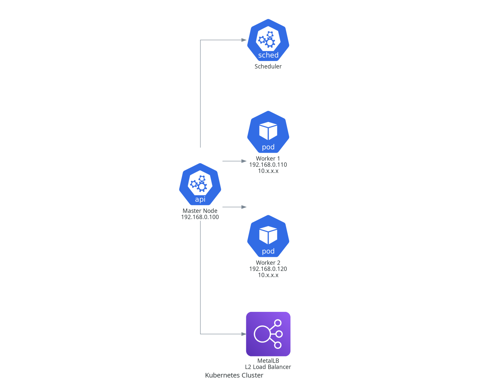

#🚀 Introduction 
This is a clone of the Azure DevOps repository.  
The purpose of this repository is to deploy a Kubernetes cluster to virtual machines running in VirtualBox using Ansible.

#🔨 Getting Started
This project aims to leverage the power of the Azure DevOps platform to deploy a fully functional Kubernetes cluster on virtual machines.

Tools & Technologies 🔧
- Azure DevOps – for CI/CD pipeline orchestration
- VirtualBox – as the virtualization platform
- Ansible – for automation and configuration management
- Kubernetes – container orchestration platform

Key Project Files 📁
**kubernetes.yml** – The main Ansible playbook detailing all essential tasks for properly configuring the Kubernetes cluster.  
**azure-pipelines.yml** – Defines the Azure DevOps pipeline that automates each step of building and deploying the Kubernetes cluster.

# ⎈ Kubernetes cluster
This Kubernetes cluster consists of one master node and two worker nodes. The cluster is set up and configured using Ansible automation, including the following key steps:  
- Basic system setup: Installing essential tools like vim, tcpdump, telnet, and configuring kernel modules needed for Kubernetes networking.
- Container runtime: Installation and configuration of containerd as the container runtime with systemd cgroup support enabled.
- Kubernetes tools: Installation of kubeadm, kubelet, and kubectl with kubelet service enabled on all nodes.
- User management: Adding a dedicated "kube" user with configured password and necessary privileges.
- Swap and firewall: Disabling swap and firewalld to meet Kubernetes requirements.
- Cluster initialization: Master node runs kubeadm init with custom configuration including pod and service subnets.
- Worker nodes join: Worker nodes join the cluster using the token and information extracted from the master.
- Kubeconfig setup: Configuration file copied to the "kube" user for cluster management.
- Calico CNI: Installation of Calico network plugin for pod networking with custom IP pool settings (CIDR 10.244.0.0/16, no encapsulation, NAT outgoing enabled).
- MetalLB: Network load balancer installed and configured with an IP address pool (192.168.0.200-192.168.0.220) in Layer 2 mode.
- Ingress controller: NGINX ingress controller deployed to manage external access to services.
- Convenience: Bash completion enabled for kubectl commands on the master node.

This setup provides a fully functional, software-defined networking, load-balanced Kubernetes cluster suitable for testing and learning DevOps and Kubernetes operations.

- Calico Network: 10.244.0.0/16 (no encapsulation, NAT enabled)
- Services subnet: 10.96.0.0/16
- External IP pool: 192.168.0.200 - 192.168.0.220 (MetalLB)
- NGINX Ingress for external access
